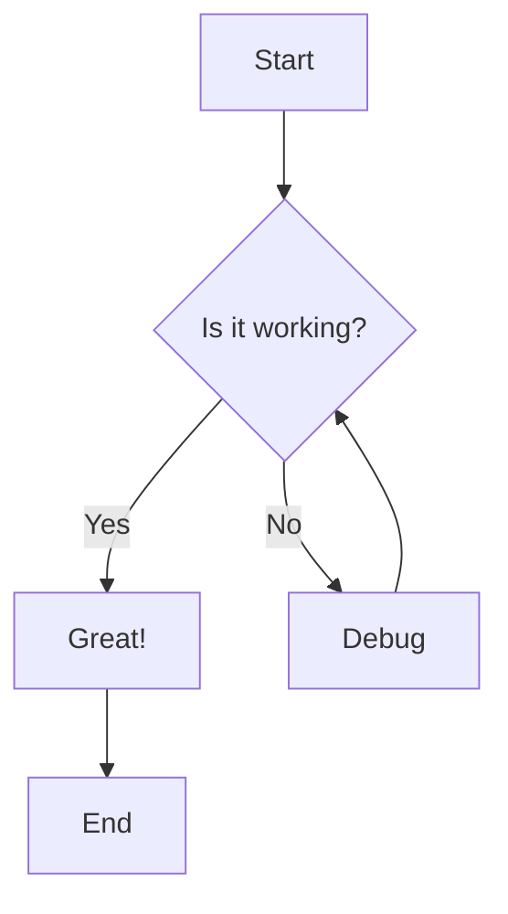
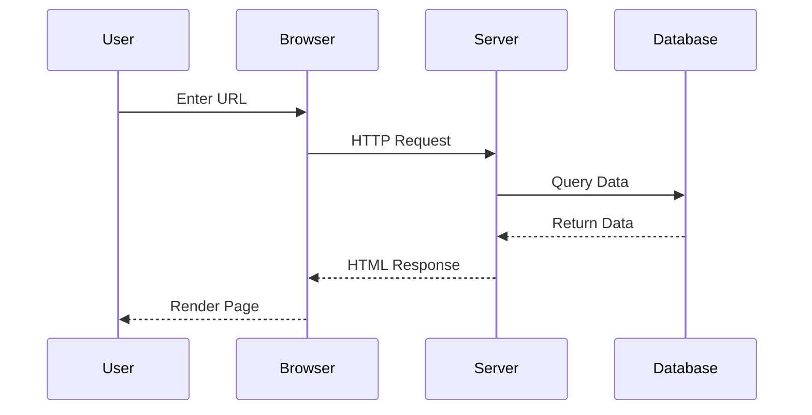
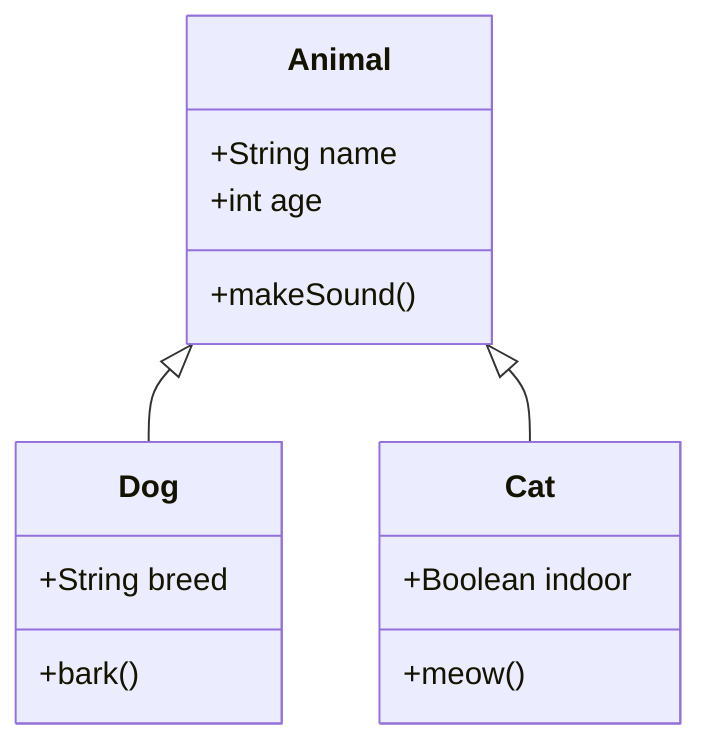
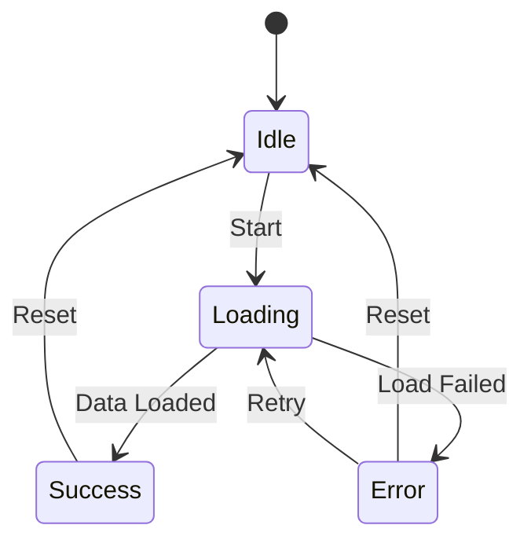
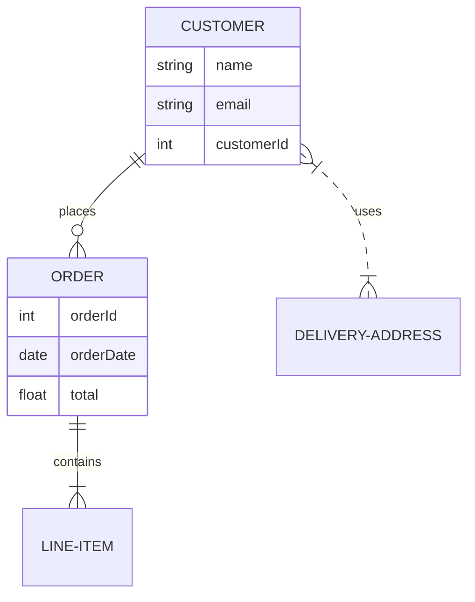
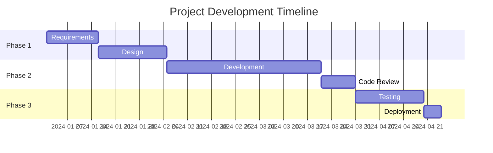
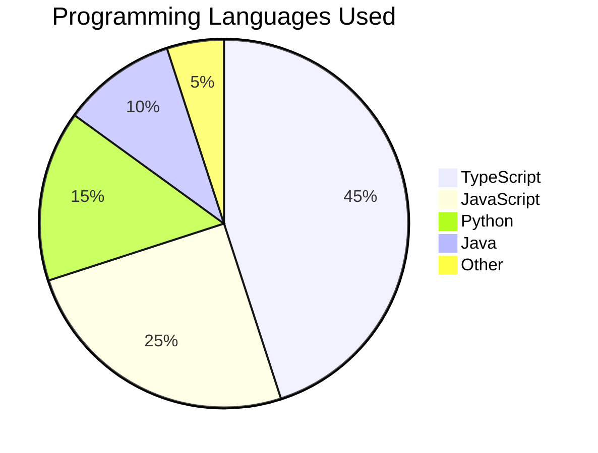
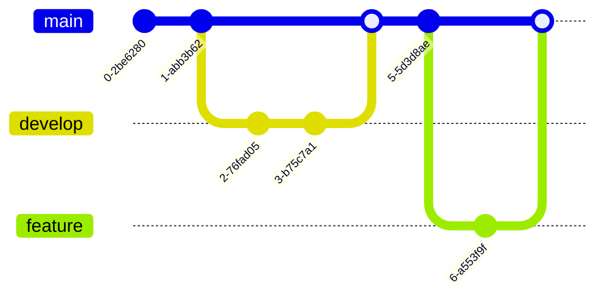
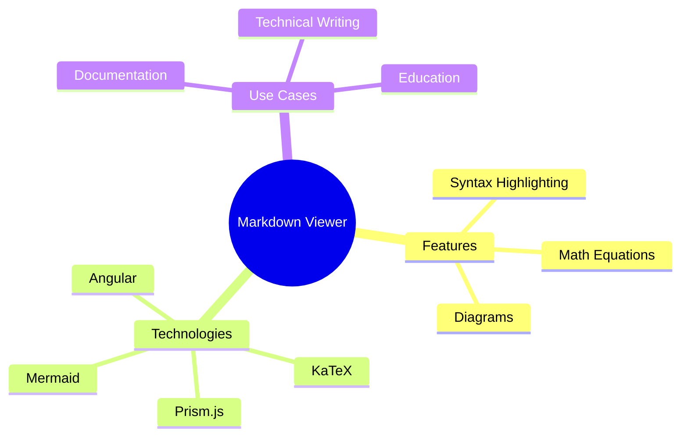
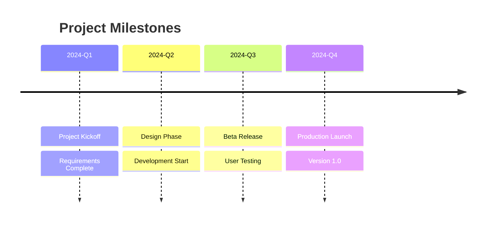

# 📄 Markdown Viewer Guide

Welcome to the **Markdown Viewer**! This comprehensive guide showcases all supported markdown features including syntax highlighting, math equations, diagrams, and more.

---

## 📝 Text Formatting

### Headers (H1-H6)

```markdown
# H1 Header

## H2 Header

### H3 Header

#### H4 Header

##### H5 Header

###### H6 Header
```

### Emphasis

- **Bold**: `**bold text**` or `__bold text__` → **bold text**
- _Italic_: `*italic text*` or `_italic text_` → _italic text_
- **_Bold and Italic_**: `***text***` or `___text___` → **_combined_**
- ~~Strikethrough~~: `~~strikethrough~~` → ~~strikethrough~~
- `Inline code`: `` `code here` `` → `code here`

### Combining Formats

You can **combine _multiple_ ~~formats~~ `together`** in a single line!

---

## 📋 Lists

### Unordered Lists

Use `-`, `*`, or `+` for bullets:

```markdown
- First item
- Second item
  - Nested item 2.1
  - Nested item 2.2
    - Deeply nested 2.2.1
    * Different marker
- Third item
```

**Example:**

- First item
- Second item
  - Nested item 2.1
  - Nested item 2.2
    - Deeply nested 2.2.1
    * Different marker
- Third item

### Ordered Lists

```markdown
1. First item
2. Second item
   1. Nested numbered item
   2. Another nested item
3. Third item
```

**Example:**

1. First item
2. Second item
   1. Nested numbered item
   2. Another nested item
3. Third item

---

## 💬 Blockquotes

Use `>` for blockquotes:

```markdown
> Single line blockquote

> Multi-line blockquote.
> This continues on the next line.

> Nested blockquotes:
>
> > This is nested
> > Inside another quote
```

**Example:**

> Single line blockquote

> Multi-line blockquote.
> This continues on the next line.

> You can use **Markdown** _inside_ blockquotes!
>
> > This is a nested quote
> > Inside another blockquote

---

## 🔗 Links and References

### Basic Links

```markdown
[Google](https://google.com)
[Link with title](https://example.com 'Example Site')
<https://auto-link.com>
```

**Example:**

[Google](https://google.com)  
[Link with title](https://example.com 'Example Site')  
<https://auto-link.com>

### Reference Links

```markdown
[Reference-style link][1]
[Another link][reference]

[1]: https://google.com
[reference]: https://example.com 'Optional Title'
```

---

## 🖼️ Images

```markdown


```

---

## 💻 Code Blocks

### Inline Code

Use backticks: `` `code` `` → `const x = 10;`

### Code Blocks with Syntax Highlighting

**TypeScript:**

```typescript
interface User {
  id: number;
  name: string;
  email: string;
  roles?: string[];
}

const getUser = async (id: number): Promise<User> => {
  const response = await fetch(`/api/users/${id}`);
  if (!response.ok) {
    throw new Error('User not found');
  }
  return response.json();
};
```

**JavaScript:**

```javascript
function fibonacci(n) {
  if (n <= 1) return n;
  return fibonacci(n - 1) + fibonacci(n - 2);
}

const result = Array.from({ length: 10 }, (_, i) => fibonacci(i));
console.log(result); // [0, 1, 1, 2, 3, 5, 8, 13, 21, 34]
```

**Python:**

```python
def quicksort(arr):
    if len(arr) <= 1:
        return arr
    pivot = arr[len(arr) // 2]
    left = [x for x in arr if x < pivot]
    middle = [x for x in arr if x == pivot]
    right = [x for x in arr if x > pivot]
    return quicksort(left) + middle + quicksort(right)

numbers = [3, 6, 8, 10, 1, 2, 1]
print(quicksort(numbers))  # [1, 1, 2, 3, 6, 8, 10]
```

**Bash:**

```bash
#!/bin/bash
npm install ngx-markdown prismjs mermaid katex
ng serve --open --port 4200
```

**JSON:**

```json
{
  "name": "office-pulse",
  "version": "1.0.0",
  "dependencies": {
    "@angular/core": "^19.0.0",
    "ngx-markdown": "^20.1.0"
  }
}
```

**CSS:**

```css
.markdown-viewer {
  max-width: 1200px;
  margin: 0 auto;
  padding: 2rem;
}

.code-block {
  background: #282c34;
  border-radius: 8px;
  padding: 1.5rem;
}
```

**SQL:**

```sql
SELECT users.name, orders.total
FROM users
INNER JOIN orders ON users.id = orders.user_id
WHERE orders.total > 100
ORDER BY orders.total DESC
LIMIT 10;
```

---

## 🧮 KaTeX Math Equations

### Inline Math

Use single dollar signs: `$E = mc^2$` → $E = mc^2$

**More examples:**

```markdown
- Pythagorean theorem: $a^2 + b^2 = c^2$
- Einstein's equation: $E = mc^2$
- Quadratic formula: $x = \frac{-b \pm \sqrt{b^2 - 4ac}}{2a}$
```

- Pythagorean theorem: $a^2 + b^2 = c^2$
- Einstein's equation: $E = mc^2$
- Quadratic formula: $x = \frac{-b \pm \sqrt{b^2 - 4ac}}{2a}$

### Display Math (Block)

Use double dollar signs for centered, large equations:

```markdown
$$
\int_{-\infty}^{\infty} e^{-x^2} dx = \sqrt{\pi}
$$
```

**Renders as:**

$$
\int_{-\infty}^{\infty} e^{-x^2} dx = \sqrt{\pi}
$$

### Greek Letters

**Lowercase:** $\alpha, \beta, \gamma, \delta, \epsilon, \zeta, \eta, \theta, \iota, \kappa, \lambda, \mu, \nu, \xi, \pi, \rho, \sigma, \tau, \phi, \chi, \psi, \omega$

**Uppercase:** $\Gamma, \Delta, \Theta, \Lambda, \Xi, \Pi, \Sigma, \Phi, \Psi, \Omega$

```markdown
**Uppercase:** $\Gamma, \Delta, \Theta, \Lambda, \Xi, \Pi, \Sigma, \Phi, \Psi, \Omega$
```

### Mathematical Operators

**Basic:**

- Addition: $a + b$
- Subtraction: $a - b$
- Multiplication: $a \times b$ or $a \cdot b$
- Division: $a \div b$ or $\frac{a}{b}$
- Plus-minus: $\pm$
- Minus-plus: $\mp$

**Advanced:**

- Summation: $\sum_{i=1}^{n} i = \frac{n(n+1)}{2}$
- Product: $\prod_{i=1}^{n} i = n!$
- Integral: $\int_a^b f(x) dx$
- Limit: $\lim_{x \to \infty} \frac{1}{x} = 0$
- Derivative: $\frac{dy}{dx}$ or $f'(x)$
- Partial derivative: $\frac{\partial f}{\partial x}$

### Relations and Logic

- Equals: $=$
- Not equals: $\neq$
- Less than: $<$, $\leq$, $\ll$
- Greater than: $>$, $\geq$, $\gg$
- Approximately: $\approx$, $\sim$
- Proportional: $\propto$
- Infinity: $\infty$
- Element of: $\in$, $\notin$
- Subset: $\subset$, $\subseteq$
- Union: $\cup$
- Intersection: $\cap$
- For all: $\forall$
- Exists: $\exists$

### Roots and Powers

- Square root: $\sqrt{x}$
- Nth root: $\sqrt[n]{x}$
- Powers: $x^2$, $x^{n+1}$
- Subscripts: $x_1$, $x_{i,j}$

### Fractions and Binomials

- Fraction: $\frac{a}{b}$
- Nested fraction: $\frac{1}{1 + \frac{1}{x}}$
- Binomial: $\binom{n}{k} = \frac{n!}{k!(n-k)!}$

### Brackets and Grouping

- Parentheses: $(a + b)$
- Brackets: $[a + b]$
- Braces: $\{a + b\}$
- Auto-sized: $\left( \frac{a}{b} \right)$
- Absolute value: $|x|$
- Norm: $\|x\|$

### Matrices and Arrays

```markdown
$$
\begin{pmatrix}
a & b \\
c & d
\end{pmatrix}
\begin{bmatrix}
1 & 0 \\
0 & 1
\end{bmatrix}
$$
```

**Renders as:**

$$
\begin{pmatrix}
a & b \\
c & d
\end{pmatrix}
\begin{bmatrix}
1 & 0 \\
0 & 1
\end{bmatrix}
$$

### Special Functions

- Trigonometric: $\sin(x)$, $\cos(x)$, $\tan(x)$
- Logarithms: $\log(x)$, $\ln(x)$, $\log_2(x)$
- Exponential: $e^x$, $\exp(x)$
- Maximum/Minimum: $\max(a,b)$, $\min(a,b)$

### Complex Example

**Fourier Transform:**

$$
F(\omega) = \int_{-\infty}^{\infty} f(t) e^{-i\omega t} dt
$$

**Taylor Series:**

$$
f(x) = \sum_{n=0}^{\infty} \frac{f^{(n)}(a)}{n!}(x-a)^n
$$

---

## 📊 Mermaid.js Diagrams

### Flowchart

Create flowcharts with various shapes and connections:



### Sequence Diagram

Show interactions between different actors:



### Class Diagram

Visualize object-oriented structures:



### State Diagram

Show state transitions:



### Entity Relationship Diagram (ERD)

Database relationships:



### Gantt Chart

Project timelines and schedules:



### Pie Chart

Show proportions and percentages:



### Git Graph

Visualize git branches and commits:



### Mindmap

Hierarchical thought organization:



### Timeline

Show events chronologically:



---

## 📋 Tables

Create tables using pipes `|` and dashes `-`:

```markdown
| Feature  | Status | Priority | Notes            |
| -------- | ------ | -------- | ---------------- |
| Markdown | ✅     | High     | Core feature     |
| Prism.js | ✅     | High     | Syntax highlight |
| Mermaid  | ✅     | Medium   | Diagrams         |
| KaTeX    | ✅     | Medium   | Math equations   |
```

**Renders as:**

| Feature  | Status | Priority | Notes            |
| -------- | ------ | -------- | ---------------- |
| Markdown | ✅     | High     | Core feature     |
| Prism.js | ✅     | High     | Syntax highlight |
| Mermaid  | ✅     | Medium   | Diagrams         |
| KaTeX    | ✅     | Medium   | Math equations   |

### Table Alignment

Use colons `:` to align columns:

```markdown
| Left aligned | Center aligned | Right aligned |
| :----------- | :------------: | ------------: |
| Left         |     Center     |         Right |
| Text         |      Text      |          Text |
```

**Renders as:**

| Left aligned | Center aligned | Right aligned |
| :----------- | :------------: | ------------: |
| Left         |     Center     |         Right |
| Text         |      Text      |          Text |

---

## ⚡ Horizontal Rules

Use three or more dashes, asterisks, or underscores:

```markdown
---

---

---
```

**Renders as:**

---

---

---

---

## 🎨 HTML in Markdown

You can use HTML for advanced formatting:

```html
<div align="center">
  <h3>Centered Content</h3>
  <p style="color: #667eea;">Styled text with HTML</p>
</div>
```

<div align="center">
  <h3>Centered Content</h3>
  <p style="color: #667eea;">Styled text with HTML</p>
</div>

---

## 📐 Escaping Characters

Use backslash `\` to escape special characters:

```markdown
\*Not italic\* \[Not a link\] \`Not code\`
```

**Renders as:**

\*Not italic\* \[Not a link\] \`Not code\`

---

## 🔤 Special Characters

Common HTML entities:

- Copyright: &copy; `&copy;`
- Registered: &reg; `&reg;`
- Trademark: &trade; `&trade;`
- Less than: &lt; `&lt;`
- Greater than: &gt; `&gt;`
- Ampersand: &amp; `&amp;`
- Non-breaking space: &nbsp; `&nbsp;`
- En dash: &ndash; `&ndash;`
- Em dash: &mdash; `&mdash;`

---

## 📌 Footnotes

Add footnotes using `[^1]` syntax:

```markdown
Here's a sentence with a footnote[^1].

[^1]: This is the footnote content.
```

Here's a sentence with a footnote[^1].

[^1]: This is the footnote content.

---

## 🎯 Definition Lists

```markdown
Term 1
: Definition 1a
: Definition 1b

Term 2
: Definition 2
```

---

## 💡 Usage Tips

### Getting Started

1. **Upload Files**: Use the file picker to upload `.md` files
2. **Load from URL**: Click "Load from URL" to fetch markdown from web
3. **View History**: Recently viewed files (max 5) appear below
4. **Copy Code**: Hover over code blocks for copy button

### Features

- ✅ **Syntax Highlighting**: 18+ programming languages
- ✅ **Math Equations**: Full LaTeX/KaTeX support
- ✅ **Diagrams**: 10+ Mermaid diagram types
- ✅ **Tables**: GitHub-flavored markdown tables
- ✅ **Local Storage**: History saved in browser

### Keyboard Shortcuts

- Press `Escape` to close dialogs
- Press `Enter` in URL input to load

---

## 🚀 Quick Reference

### Most Used Syntax

```markdown
# Heading

**bold** _italic_ `code`
[link](url) 

- list item
  > quote
```

### Code Block Languages

TypeScript, JavaScript, Python, Java, C++, C#, Go, Rust, PHP, Ruby, Swift, Kotlin, SQL, HTML, CSS, SCSS, JSON, YAML, Markdown, Bash, Shell, and more!

### Math Symbols Quick Access

```
$x^2$ $\sqrt{x}$ $\frac{a}{b}$ $\sum$ $\int$ $\alpha$ $\beta$
```

---

**Happy documenting! 📝✨**

> Made with ❤️ using Angular, Prism.js, Mermaid.js, and KaTeX
