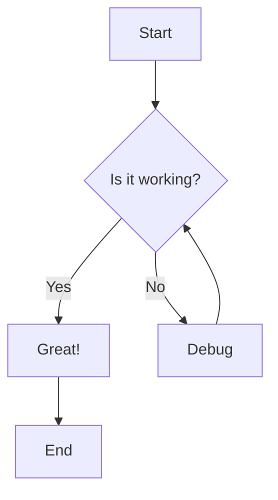
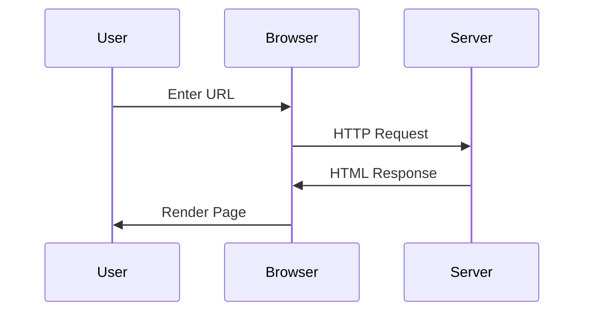
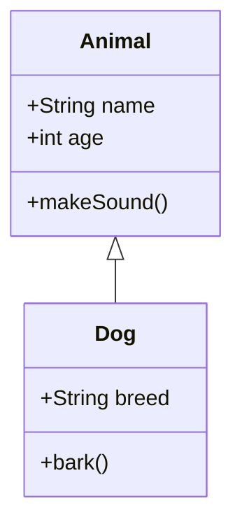
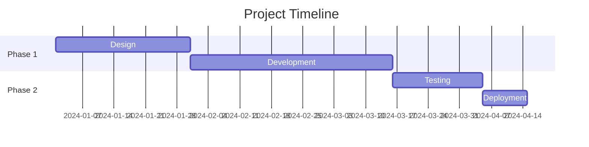

# Markdown Viewer Guide

Welcome to the Markdown Viewer! This tool supports **advanced markdown features** including syntax highlighting, math equations, and diagrams.

## 📝 Basic Markdown Syntax

### Headers

Use `#` for headers (H1-H6):

```markdown
# H1 Header

## H2 Header

### H3 Header
```

### Text Formatting

- **Bold**: `**text**` or `__text__`
- _Italic_: `*text*` or `_text_`
- ~~Strikethrough~~: `~~text~~`
- `Inline code`: `` `code` ``

### Lists

**Unordered:**

```markdown
- Item 1
- Item 2
  - Sub-item
```

**Ordered:**

```markdown
1. First
2. Second
3. Third
```

---

## 💻 Prism.js Syntax Highlighting

Wrap code blocks with triple backticks and specify the language:

```typescript
interface User {
  id: number;
  name: string;
  email: string;
}

const getUser = async (id: number): Promise<User> => {
  const response = await fetch(`/api/users/${id}`);
  return response.json();
};
```

```python
def fibonacci(n):
    if n <= 1:
        return n
    return fibonacci(n-1) + fibonacci(n-2)

print([fibonacci(i) for i in range(10)])
```

```bash
npm install ngx-markdown prismjs mermaid katex
ng serve --open
```

---

## 🧮 KaTeX Math Equations

### Inline Math

Use single dollar signs: `$E = mc^2$` renders as $E = mc^2$

### Block Math

Use double dollar signs:

```
$$
\frac{-b \pm \sqrt{b^2 - 4ac}}{2a}
$$
```

Renders as:

$$
\frac{-b \pm \sqrt{b^2 - 4ac}}{2a}
$$

**Common Symbols:**

- Greek: `$\alpha, \beta, \gamma, \Delta, \Omega$` -> $\alpha, \beta, \gamma, \Delta, \Omega$
- Operators: `$\sum, \prod, \int, \lim$` -> $\sum, \prod, \int, \lim$
- Relations: `$\leq, \geq, \neq, \approx$` -> $\leq, \geq, \neq, \approx$

---

## 📊 Mermaid.js Diagrams

### Flowchart

```markdown
graph TD
A[Start] --> B{Is it working?}
B -->|Yes| C[Great!]
B -->|No| D[Debug]
D --> B
C --> E[End]
```



### Sequence Diagram

```markdown
sequenceDiagram
participant User
participant Browser
participant Server
User->>Browser: Enter URL
Browser->>Server: HTTP Request
Server->>Browser: HTML Response
Browser->>User: Render Page
```



### Class Diagram

```markdown
classDiagram
class Animal {
+String name
+int age
+makeSound()
}
class Dog {
+String breed
+bark()
}
Animal <|-- Dog
```



### Gantt Chart

```markdown
gantt
title Project Timeline
dateFormat YYYY-MM-DD
section Phase 1
Design :a1, 2024-01-01, 30d
Development :a2, after a1, 45d
section Phase 2
Testing :a3, after a2, 20d
Deployment :a4, after a3, 10d
```



---

## 📋 Tables

```markdown
| Feature  | Status | Priority |
| -------- | ------ | -------- |
| Markdown | ✅     | High     |
| Prism.js | ✅     | High     |
| Mermaid  | ✅     | Medium   |
| KaTeX    | ✅     | Medium   |
```

Renders as:

| Feature  | Status | Priority |
| -------- | ------ | -------- |
| Markdown | ✅     | High     |
| Prism.js | ✅     | High     |
| Mermaid  | ✅     | Medium   |
| KaTeX    | ✅     | Medium   |

---

## 🔗 Links and Images

**Links:** `[Google](https://google.com)`

**Images:** ``

---

## 💡 Tips

1. **Upload your markdown file** using the file input above
2. Files are saved in history (max 5) for quick access
3. Click on history items to reload them
4. Clear individual entries or all history as needed
5. All content is stored locally in your browser

**Happy documenting! 🚀**
